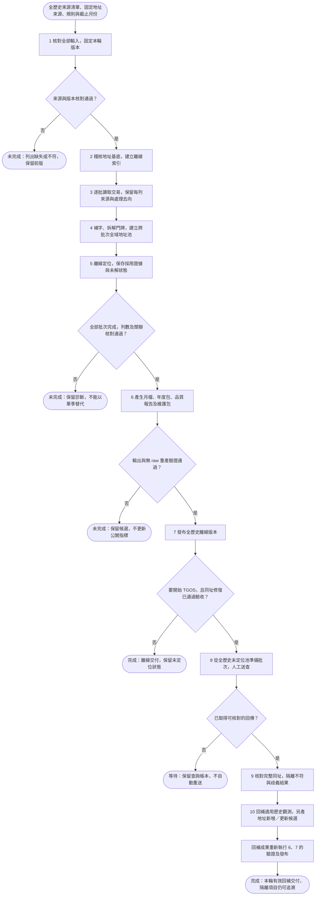

# 資料架構與處理

本文件集中說明資料來源、現有操作、資料契約、地址判定及 TGOS 處理。新版全歷史流程與 TGOS 修復仍待實作。下載見[README](../README.md#下載資料)，開發及發布見[CONTRIBUTING](../CONTRIBUTING.md)。

## 閱讀順序

- [完整資料處理流程](#完整資料處理流程)
- [使用與資料處理](#使用與資料處理)
- [全量循環作業](#全量循環作業)
- [資料規格](#資料規格)
- [地址處理規則](#地址處理規則)
- [TGOS 操作](#tgos-操作)
- [資料來源沿革](#資料來源沿革)

## 完整資料處理流程

這一節依重建企劃說明一次作業如何從原始交易資料走到可下載成果。它定義要完成的處理流程，不表示現行程式已全部支援。各步驟的既有命令與缺口列在本節末尾，工作依賴與驗收編號仍以[重建企劃](plans/重建企劃.md)為準。

### 全歷史作業的起點與終點

一次作業固定全部選定歷史批次、買賣／預售屋／租賃三類資料、截止月份、地址來源版本及補字規則。基準清單目前列出 58 批，但仍須核對來源完整性。內部可分批讀寫與續跑，不能只完成一季就宣告全量完成。

第一個交付是全歷史離線版本。已處理但未定位的觀測仍須輸出，不能等待所有地址都有座標才交付。缺失來源、遺漏資料列或未完成階段則不能當成「未定位」略過。

圖中的步驟編號對應下方說明。菱形表示判斷，分支標示「是／否」，終點分為完成、等待與未完成。這是目標流程，並非可直接執行的現有全量命令。



地址新增／更新候選是步驟 10 的另一項產物，不代表地址專案已匯入，也不是實價登錄回補發布的必要前置條件。人工 TGOS 尚未返回時，已完成的離線版本仍可使用。

### 1 核對來源並固定執行版本

輸入包括原始 ZIP 清單、固定地址資料、官方地址來源、路名參考、補字規則及程式提交。實際來源位置見[準備來源](#準備來源)。

逐批核對批次、檔案雜湊、ZIP 成員與來源結構。已知空批次必須有證據，缺檔不能推定為空。另確認全清單的範圍是否足以支援本輪宣告，不能只因本機有 58 個 ZIP 就認定完整。

本輪清單須綁定輸入與規則版本、類別、截止月份及執行識別。核對不符時保留清單與原因，停止全量完成宣告。原始 ZIP 不改寫，也不納入 Git。

### 2 稽核地址基底並建立索引

輸入是步驟 1 固定的全部選定地址檔。交易地址與地址基底須使用同一套補字、正規化及完整身分規則，否則同一個地址會產生不同鍵。

先分類完全重複、同址座標差異、無效地址、無效座標及未解衝突，再建立可供查詢的索引。不能假設 FULL_ADDR 唯一，也不能取重複資料的第一列當答案。精度容許值須有量測依據及規則版本。

輸出是固定版本的索引、逐筆來源證據及基底稽核結果。有衝突的地址仍保留全部證據，但不自動成為有效定位。若索引無法完整建立，不能使用部分索引宣告整輪完成。

### 3 讀取交易並正規化來源觀測

逐批、逐成員讀取三類交易資料。先保留原始欄位與來源位置，再處理日期、數值、地址文字及分類。民國日期須經 validated_roc_to_tx_yyyymm 驗證，不能直接截字串推定月份。截止月份與排除規則固定於本輪。

每列來源都必須有保留、排除或失敗的去向與原因。保留觀測進入 converted 資料，排除與失敗留在診斷紀錄。分項數量須能回到來源列總數，重疊的診斷標記不能重複計入去向總數。

raw_record_id 追溯來源觀測。上游序號或相同地址不足以證明同一筆交易，因此不推定跨批次交易去重，也不猜測修訂順序。金額以觀測為單位保留，多門牌不能複製出多筆金額。

### 4 補字、拆解地址並建立全域地址池

每個保留觀測先套用有範圍及證據的補字規則，保留修正前後文字與規則版本。再拆解地址成員及完整門牌。舊專案已確認的字元案例必須逐案比對，新舊補字檔相同不能代替驗收。

仍含缺字時，利用路名參考與離線索引產生候選。只有唯一文字解且具有效門牌證據時才可採用。多解、無解及身分不明都保留待覆核，不猜字、不丟棄該筆觀測。

完整身分確定後，才建立或重用全域地址鍵。不同批次及類別出現同一個有效地址鍵時，共用定位結果，但各來源觀測與地址成員的出現關聯仍分別保留。樓層移除、主號與子號等規則見[完整同址判定](#完整同址判定)。

輸出是跨批次地址池、觀測到地址成員的關聯，以及補字與拆解診斷。無法建立完整身分的成員仍須有可追溯紀錄，不能因未進入可定位地址集合而消失。

### 5 離線定位與證據採用

以每個唯一地址查詢步驟 2 的索引。先確認完整同址，再檢查座標與來源證據，最後才決定是否採用。來源優先序不能越過同址判定。

| 查詢結果 | 狀態與後續處理 |
| --- | --- |
| 有無歧義的有效證據 | 記錄已定位、座標、來源及採用依據 |
| 同址證據互相衝突 | 保留衝突，不任取首列或平均 |
| 候選屬於多個門牌（村里或鄰不同）且座標不同 | 不定位，列入人工交叉比對清單（R04-12） |
| 沒有匹配 | 保留未命中，後續仍須檢查是否適合送 TGOS |
| 來源未涵蓋 | 保留涵蓋限制，不偽裝成已完整搜尋 |
| 缺字或身分尚未確定 | 保留待覆核，不直接送查 |
| 縣市在暫停定位清單內（R05-9） | 不論座標是否一致都不定位，座標保留在證據，交易列入待查核表 `address_source_suspended` |

已知限制（R05-9，擁有者 2026-10-09 決定）：固定地址來源中澎湖縣、金門縣的經度偏東約 2 度。`config/pipeline.example.toml` 的 `suspended_counties` 列出這兩縣與原因，這兩縣的地址鍵一律不定位，TGOS 已定位的也一樣，所以點位檔沒有這兩縣的交易。本專案不換算、不修正座標，等地址資料專案修正來源後再改清單重建。連江縣不在清單內。清單納入離線狀態的綁定；離線狀態以狀態 `conflict`、依據 `address_source_suspended` 記錄這些鍵，報告的 `address_suspension_counts` 列出每縣鍵數與受影響的 TGOS 鍵數。`prepare-tgos` 不把清單內縣市的鍵列為送查候選，報告 `tgos_suspended_candidates_excluded` 依縣市列出排除數（R09-0，擁有者 2026-10-09 選 A）。

地址池中的狀態要能回接所有來源觀測的地址成員。一筆多門牌觀測可能完全定位、部分定位或全未定位，三者不能混為一談。全部選定批次及關聯核對完成後，才進入輸出階段。

### 6 組合 GIS 月檔與完整交付包

將 converted 觀測、地址成員關聯與有效定位狀態組合，依交易月份及類別產出 GeoParquet、GeoJSON、NDJSON。資料仍以來源觀測為單位，geometry 的選擇見[GIS 輸出](#gis-輸出)。無定位仍輸出 null，部分定位保留品質標記。

年度 ZIP 包含同一版本的原月檔，不能在打包時重新產生另一份內容。大型附件須有完整分片清單與驗證方式。另產生品質報告、來源顯名與限制，以及無原始 ZIP 也能接續的維護包。

品質報告分開呈現來源涵蓋與定位品質。至少核對來源去向、金額、跨表關聯、唯一地址狀態、三格式一致性、年包雜湊及資源使用。來源缺失不能以 geometry 為 null 掩蓋。

### 7 驗證與發布離線版本

先驗證候選全部附件，再於乾淨 Linux 環境使用維護包，在無 raw ZIP 的條件下重產並核對月檔雜湊。通過後依發布流程上傳、核對公開附件，最後更新版本指標。

下載成功、單季測試通過或已產生月檔，都不能代替全歷史驗收。驗證失敗時保留前版與失敗候選，不更新公開指標。操作步驟與復原責任見[CONTRIBUTING](../CONTRIBUTING.md#發布與復原)。

### 8 從全歷史未定位池準備 TGOS 查詢

新輪次必須等全歷史離線交付與 TGOS 同址修復都完成。重新查核候選，排除已定位、缺字、衝突、身分不明及已有保留／送出紀錄的查詢。不是所有未定位地址都能送 TGOS。

每個交換檔最多選取 10,000 筆，再持久保存批次、查詢識別與送出原文。`data/tgos/date.json` 的日期只決定交換檔資料夾名稱中的 `YYYYMMDD`。人工上傳後明確記錄已送出、未送出或提交不明。提交不明時不自動重送。交換格式與帳本限制見[TGOS 操作](#tgos-操作)。

### 9 匯入回傳並驗證完整同址

先核對回傳檔案及查詢集合，再逐筆檢查查詢成功狀態、完整同址與座標有效性。缺列、重複列、混入其他批次與格式不符須留下明確拒絕原因。

回傳與查詢只有縣市、行政區相同，仍不足以採用。道路、段巷弄、主門牌與子號都要核對。不同址結果隔離，無法判定者待覆核，均不得定位原查詢地址或建立已驗證別名。

有效結果保存為可追溯證據。同一檔案重匯不得重複新增觀測。舊錯配另依原回傳重新驗證，追查並撤銷其衍生別名與定位，不必重新送查才修復歷史錯誤。

### 10 回補歷史觀測並產生地址交接候選

有效證據經適用性核對後，透過地址成員關聯回補所有適用歷史觀測，包括跨年及三種類別。座標觀測時間與已知有效期間須保留，現代門牌的位置不能直接當成歷史建物的位置。

重新產生受影響月檔及對應年度包，核對其他月檔雜湊保持不變。撤銷舊錯配也走相同回補路徑，不能只更正目前季度。新版本須重新完成步驟 6、7 的驗證與發布。

另將有效證據與地址專案的固定基底比對，產生新增、既有證據、座標更新或隔離結果。不能把文字已存在的地址全部當新增。14 欄候選與來源關聯一併交付，實際跨專案匯入另記驗收。詳見[地址專案交接](#地址專案交接)。

### 階段產物與續跑邊界

下表說明目標階段契約，不預先指定尚未實作的檔名。目前接續使用的工作快照在 `data/tmp/work/`，企劃中的 `data/runs/` 布局待 R06-4 實作，見「全量循環 0」。

| 階段產物 | 必須保留 | 下一階段依賴 |
| --- | --- | --- |
| 本輪來源清單 | 批次、檔案雜湊、版本、範圍與規則綁定 | 所有後續階段 |
| 地址索引與稽核 | 固定來源、完整身分、座標與衝突證據 | 補字候選與離線定位 |
| 正規化觀測 | 原始追溯、處理去向、交易月份與數值 | 地址池、GIS 輸出及無 raw 重產 |
| 全域地址池與出現關聯 | 每個地址鍵及原觀測成員關聯 | 定位、歷史回補 |
| 定位狀態與帳本 | 採用／隔離證據、別名、批次及查詢狀態 | 輸出、TGOS 續作及更正 |
| 發布候選與維護包 | 月檔、年包、清單、品質、顯名及雜湊 | 公開驗證、下載、復原 |

續跑只重用輸入、規則及程式綁定相符且已驗證的完整階段。中途失敗不能使半成品變成有效快照。綁定改變時須判定重算範圍並另留執行紀錄，不覆寫原始證據，也不重設 TGOS 帳本。重建後的續跑契約仍待 R-03、R-06 實作與驗收。

### 現有能力與重建缺口

命令存在只代表已有入口，不表示它已滿足上面的完整契約。本次文件補寫未重新執行真實處理。

| 流程範圍 | 現有入口或證據 | 尚待完成 |
| --- | --- | --- |
| 來源及轉換 | raw_manifest、ingest、normalize、export-converted、verify-converted | 全來源核對、一次全量啟動及完整續跑驗收 |
| 補字及離線 | build-offline-index、build-address-pool、resolve-offline、verify-offline-state | 舊字元逐案承接、全部基底稽核、統一地址身分與衝突規則 |
| GIS 及發布 | package-output、verify-output、publish-output、commit-release-pointer | 全歷史成品、資源量測、附件與無 raw 重產驗收 |
| TGOS | prepare-tgos、import-tgos、verify-tgos-state | 完整同址修復、舊錯配撤銷及全歷史新輪次 |
| 回補及地址候選 | backfill-output、export-address-patch、verify-address-patch | 全歷史適用性、既有／新增／更新判定與跨專案真實驗收 |

現有可執行範例接在下一節。全量命令實作前不提供尚不存在的全量指令。[全歷史驗收](records/全歷史驗收.md)仍為 not-run，不能因本節補齊說明就改為完成。

## 使用與資料處理

目前可執行既有轉換與離線定位命令。新版「一次啟動全部歷史批次、續跑並驗收」尚未實作。重建的首個資料交付必須涵蓋全部選定來源，不能用單季試跑取代。工作順序見[重建企劃](plans/重建企劃.md)。

### 安裝與命令入口

在專案根目錄執行。環境由 `uv.lock` 固定，目前使用 Python 3.13.16 與 uv 0.12.23。Linux 已安裝 uv 後執行：

```bash
bash scripts/setup.sh
```

Windows 執行：

```powershell
uv sync --locked --group dev --python 3.13.16
uv run --locked --python 3.13.16 python scripts/build_fixtures.py
uv run --locked --python 3.13.16 python -m pytest -q
```

安裝與測試只使用合成資料，不下載真實資料，也不需要 TGOS 憑證。檢視既有命令：

```bash
uv run --locked --python 3.13.16 python -m lvr_pipeline --help
```

### 準備來源

| 輸入 | 目前位置 | 使用條件 |
| --- | --- | --- |
| 交易來源清單 | [raw_manifest.json](../config/sources/raw_manifest.json) | 已盤點 58 批，不代表已完成全量驗收 |
| 原始交易 ZIP | `data/raw/<batch>_lvr_landcsv.zip` | 按清單核對雜湊與 ZIP 成員，缺失不能當成空批次 |
| 地址來源描述 | [address_source.json](../config/sources/address_source.json) | 固定來源提交及檔案，不任意改用最新版本 |
| 臺北市官方來源描述 | [official_taipei.json](../config/sources/official_taipei.json) | 固定本機來源檔及其雜湊 |
| 補字規則 | [garbled_override.csv](../config/rules/character-fixes.csv) | 舊規則已存在，逐案承接驗收仍待執行 |
| 路名參考 | [來源紀錄](../config/reference/roadnames_35321.provenance.txt) | 保留來源與適用限制 |

舊專案 `C:/Code/taiwan-lvr-geojson` 僅作唯讀參考。地址專案預設位於同層的 `C:/Code/taiwan-address-data`。本次文件整理沒有下載、搬移或重新核對真實輸入。

已知空批次必須有清單證據，例如舊紀錄中的 `101q1`，不能由檔案缺失推定。現有命令不會因存在 `.env` 就自動載入其中設定。舊入口的 `GARBLED_PATH` 與新 CLI 的 `--garbled-rules` 應依各入口說明設定。

### 既有轉換操作

以下是單批語法範例，用於診斷。請換成未使用的 run ID 與本次固定的截止月份：

```bash
uv run --locked --python 3.13.16 python -m lvr_pipeline export-converted --batch 115q1 --cutoff 202610 --run-id example-115q1
uv run --locked --python 3.13.16 python -m lvr_pipeline verify-converted --input data/work/converted/snapshots/example-115q1
```

`--batch` 可重複指定。增加批次參數不等於新版全歷史流程已驗收。來源觀測、排除與失敗筆數都須核對，詳見[資料規格](#資料規格)。

### 既有離線階段

| 順序 | 命令 | 必要輸入 |
| --- | --- | --- |
| 1 | `build-offline-index` | 固定地址資料與來源描述 |
| 2 | `build-address-pool` | 已驗證 converted 快照及索引 |
| 3 | `resolve-offline` | 地址池與相同版本索引 |
| 4 | `verify-offline-state` | 產生的離線狀態 |

各命令的路徑參數以 `python -m lvr_pipeline 命令 --help` 為準。目前接續使用的階段快照在 `data/tmp/work/`，尚未遷移至企劃中的 `data/runs/`。使用官方來源時，來源描述與實體檔案必須配對。

續跑前核對輸入、規則及狀態版本。若狀態已開始 TGOS 作業，不得用重建離線狀態抹除既有帳本。現有快照與續跑限制的歷史範例保存在[P2 紀錄](records/P2離線驗收.md)。

### 全歷史交付與下一步

完整流程圖及模組邊界集中在[企劃第五節](plans/重建企劃.md#五主要流程與程式邊界)。R-06 實作全量入口後，才會在本文件加入可執行的全歷史命令。

全量結果記入[全歷史驗收](records/全歷史驗收.md)。TGOS 現有匯入有同址判定缺陷，後續處理須遵守[TGOS 操作](#tgos-操作)。取得現有公開成品見[資料下載](../README.md#下載資料)。

## 全量循環作業

本節說明在 Linux 雲端主機上，如何把原始交易資料處理至離線定位，完成 TGOS 人工送查循環，再輸出月檔與年度包。結果是快速版 v2，不作為 V-08～V-11 或 V-12 的驗收依據。

**實測範圍**：本節的命令與數值來自 2026-10-07～08 在 Windows 11 上對全量資料執行的 F-3、F-4、F-4b、F-5、F-5a，完整紀錄在[快速全量資料 v2](records/快速全量資料v2.md)。**整條真實資料流程從未在 Linux 上執行過。** 擁有者決定不先做 Linux 試跑，直接搬到雲端；Linux 上出現的問題要在雲端處理。耗時與 RSS 是 Windows 數值，只供規劃。

本節使用現有的分段命令。單一全量入口 `run-full` 尚未實作，由 R06-4 負責。重建企劃的目標流程見[完整資料處理流程](#完整資料處理流程)，TGOS 規則見[TGOS 操作](#tgos-操作)。

**慣例**

- 所有命令都在專案根目錄執行。為縮短命令，先設定：

  ```bash
  LVR="uv run --locked --python 3.13.16 python -m lvr_pipeline"
  ```

- `<run-id>` 是本輪識別，例如 `fast2`。同一個階段的快照 ID 不可用於不同的輸入。
- 每個階段的快照放在 `<工作目錄>/<階段>/snapshots/<快照 ID>/`。階段目錄依序是 `ingested`、`normalized`、`converted`、`offline-index`、`address-pool`、`offline-state`、`tgos-state`。工作目錄預設是 `data/work`，用 `--work-dir` 改變。
- 命令成功時印出 JSON 並以結束代碼 0 離開。失敗時印出 `{"error": ..., "completed": false}` 並以 1 離開。長時間命令請在 `tmux` 或 `nohup` 下執行，並接 `2>&1 | tee <工作目錄>/logs/<步驟>.log`。

### 全量循環 0 目前 `data/` 布局（2026-10-08 整理）

依企劃第四節的目標布局整理。尚未符合目標、但目前仍需使用的內容放在 `data/tmp/`；`data/runs/` 要等 R06-4 的 `run-full` 才會使用。

| 位置 | 內容 |
| --- | --- |
| `data/raw/` | 58 個原始交易 ZIP |
| `data/cache/` | 官方來源快取 |
| `data/tgos/` | `date.json` 與各批交換資料夾，含人工下載的回傳檔 |
| `data/output/fast2-output-e/` | 快速版 v2 最新輸出：`monthly/`（含 GIS 屬性欄位）、`yearly/`（年度包與 `<年>_<類別>_points.csv` 點位檔，追溯欄位為 `source_ref`）、維護包分片與索引 |
| `data/output/p2-115q1-offline-v2/` | 目前公開版本的本機副本 |
| `data/tmp/work/ingested/`、`fast2/`、`fast2b/` | 接續工作用的階段快照，以 `--work-dir` 指定 |
| `data/tmp/work/tgos-state/` | F-1 的 TGOS 狀態，作為來源紀錄 |
| `data/tmp/work/logs/` | 各次執行的日誌 |
| `data/tmp/review/` | 補字規則查核表 |
| `data/tmp/legacy-evidence/` | R09-4 舊錯配清查要用的舊輸出、舊地址 patch 與發布收據 |

檢查、驗證、診斷與查核用的輸出，例如維護包重組檢查或匯出的分析檔，以及失敗後需要保留的產物，一律放在 `data/tmp/<用途>/`，不放進 `data/output/`。

程式的 `--work-dir` 預設仍是 `data/work`。本節命令一律明確指定工作目錄。

### 全量循環 1 環境

1. 準備 Linux 主機，安裝 `git` 與 `uv`（專案目前使用 uv 0.12.23）。`uv` 依 `.python-version` 使用 Python 3.13.16。
2. 取得本專案，切到要執行的提交，執行：

   ```bash
   bash scripts/setup.sh
   ```

   腳本會執行 `uv sync --locked --group dev --python 3.13.16`、產生合成測試資料並跑 `pytest`。測試只用合成資料，不下載真實資料。GitHub Actions 在 Ubuntu 上執行同一個腳本約 1 分 54 秒。
3. 設定 DuckDB 環境變數。未設定時，程式預設為 2 執行緒、記憶體上限 256MB、暫存上限 1GiB，全量資料會因超過上限而失敗，因此必須放寬：

   ```bash
   export LVR_DUCKDB_THREADS=4
   export LVR_DUCKDB_MEMORY_LIMIT=16GB
   export LVR_DUCKDB_TEMP_LIMIT=100GiB
   ```

   上列是 Windows 實測使用的值。雲端主機的合適值待 Linux 實測。
4. `ingest` 開始前會做保守的磁碟預檢：目標磁碟可用空間的 80% 須不少於「ZIP 成員解壓後大小總和 × 12」，否則停止。

**資源需求（2026-10-07～08 Windows 實測）**

- 記憶體：各步驟 RSS 峰值約 3 GB（見下表）。Windows 主機另設 DuckDB 記憶體上限 16GB。
- 磁碟，單輪從讀取快照到輸出：
  - 工作目錄：讀取快照 `ingested` 5.3 GB（F-3 沿用既有快照，未重讀）；`data/tmp/work/fast2`（正規化、轉換、索引、地址池、離線狀態，以及 F-4 第一次留下的 TGOS 狀態）15 GB；`data/tmp/work/fast2b`（TGOS 狀態）3 GB。合計約 23 GB。這台機器的 `data/work` 全部約 48 GB，含更早的快速版與驗證快照，不是單輪需求。
  - 輸出：每輪 `package-output` 約 25 GB（總計 25,953,761,652 bytes）。失敗時殘留的 `.staging` 也約 25 GB，不會自動刪除。
  - 建議雲端磁碟至少 150 GB 可用，並且剩餘低於 20% 時停止。這是依上列數值加上殘留與重跑的餘量所作的估計，未在 Linux 驗證。

| 步驟 | 耗時 | RSS 峰值 |
| --- | --- | --- |
| `ingest`（58 批） | 未單獨量測 | 未記錄 |
| `normalize` | 2,818 秒（47.0 分） | 2,987,966,464 bytes |
| `export-converted` | 3,372 秒（56.2 分） | 2,959,241,216 bytes |
| `build-offline-index`（22 個縣市代碼，10,624,627 列） | 692 秒（11.5 分） | 未記錄 |
| `build-address-pool` | 1,455 秒（24.3 分） | 未記錄 |
| `resolve-offline` | 490 秒（8.2 分） | 未記錄 |
| `verify-offline-state` | 115 秒 | 未記錄 |
| `prepare-tgos`（10,000 筆，帶入既有帳本） | 503 秒（8.4 分） | 未記錄 |
| `import-tgos`（10,000 筆） | 837 秒（14.0 分） | 未記錄 |
| `verify-tgos-state` | 約 2 分 | 未記錄 |
| `package-output` | 3,499 秒（58.3 分，含開始寫入前約 25 分鐘的載入與核對）。程式自報 2,613 秒 | 2,945,605,632 bytes（程式自報，不含 DuckDB 以外的子程序） |
| `verify-output` | 899 秒（15.0 分） | 未記錄 |

`normalize` 至 `verify-offline-state` 合計約 8,942 秒（約 149 分），不含讀取。

### 全量循環 2 輸入

1. 原始 ZIP：把 58 個 `<批次>_lvr_landcsv.zip`（101q1 至 115q2，例如 `115q2_lvr_landcsv.zip`）放進 `data/raw/`，合計 674,172,610 位元組（依 [raw_manifest.json](../config/sources/raw_manifest.json)）。下載頁位置記在 manifest 的 `source_page`。101q1 是已知空批次，只含 `manifest.csv` 與 `build.ttt`；其他缺檔不能當成空批次。
2. 核對：`ingest` 讀取前會逐檔核對大小、SHA-256、ZIP 成員與已知空批次，任何不符都會中止（錯誤如 `Raw size/hash mismatch`、`Raw manifest mismatch: members`）。獨立的 `verify-sources` 命令尚未實作，規劃在 R-06。因此直接執行「全量循環 3」的 `ingest` 即完成核對。
3. 地址資料專案：它固定在 [address_source.json](../config/sources/address_source.json) 的 `commit` 欄位，目前值為 `3ff9be0265b22a4910abf2bd4e3e96c7653fb6f0`，儲存庫為 `https://github.com/monkey1wizard/taiwan-address-data`。以全新複製取得，只在本機複本切到該提交，不修改該專案：

   ```bash
   git clone https://github.com/monkey1wizard/taiwan-address-data ../taiwan-address-data
   git -C ../taiwan-address-data checkout --detach 3ff9be0265b22a4910abf2bd4e3e96c7653fb6f0
   git -C ../taiwan-address-data rev-parse HEAD
   git -C ../taiwan-address-data status --porcelain
   ```

   `rev-parse` 的輸出必須等於 `address_source.json` 的 `commit`，`status --porcelain` 必須沒有輸出。不要在該目錄執行 `pull`、`commit`、`push` 或其他會改動檔案的命令。這組複製命令本身尚未在雲端主機實測，取得儲存庫的讀取權限也須事先確認。
4. 版本不符時，`build-offline-index` 逐檔核對路名檔雜湊，錯誤為 `Address road hash mismatch`。2026-10-06 的快速版曾因地址專案前進到新提交，在 `build-address-pool` 失敗。遇到不符時，不要改用最新版本，也不要自行執行 `pin-address-source`。該命令會改寫來源描述，須由擁有者決定。

### 全量循環 3 全量處理

以下命令是 F-3 實際使用的順序與參數。`<W>` 代表本輪工作目錄，例如 `data/tmp/work/fast2`；**每次改變正規化規則後必須用全新的 `<W>`**（見「全量循環 9」規則 1）。`<run-id>` 換成未使用過的值。

1. 讀取全部 58 批。`--batch` 必須明確列出，沒有「全部」選項：

   ```bash
   BATCHES=$(uv run --locked --python 3.13.16 python -c "import json;print(' '.join('--batch '+e['batch'] for e in json.load(open('config/sources/raw_manifest.json'))['inputs']))")
   $LVR ingest $BATCHES --work-dir <W> --run-id <run-id>-ingest
   ```

   第一行只是從 manifest 組出 58 個 `--batch` 參數的輔助寫法，沒有單獨實測，也可手動列出。F-3 沿用既有讀取快照 `data/tmp/work/ingested/snapshots/fast-all58-v3-ingest`，沒有重讀 ZIP；沿用時，直接把該路徑傳給下一步的 `--input`。
2. 正規化：

   ```bash
   $LVR normalize --input <讀取快照路徑> --work-dir <W> \
     --cutoff 202610 --garbled-rules config/rules/character-fixes.csv \
     --run-id <run-id>-normalize
   ```

   `--cutoff` 是本輪截止年月。下一步 `export-converted` 必須使用相同值，否則程式拒絕。
3. 轉換與複驗：

   ```bash
   $LVR export-converted --input <W>/normalized/snapshots/<run-id>-normalize \
     --work-dir <W> --cutoff 202610 --run-id <run-id>-converted
   $LVR verify-converted --input <W>/converted/snapshots/<run-id>-converted
   ```

   `verify-converted` 是選用的獨立複驗，F-3 沒有執行。核對輸入列數：輸入來源列 6,169,758，保留 4,377,484、排除 1,792,230、失敗 44，三者相加等於輸入列。列數改變時先查明原因。
4. 建離線索引。F-3 明確傳入 22 個縣市代碼：

   ```bash
   COUNTIES=""
   for c in 09007 09020 10002 10004 10005 10007 10008 10009 10010 10013 10014 10015 10016 10017 10018 10020 63 64 65 66 67 68; do COUNTIES="$COUNTIES --county $c"; done
   $LVR build-offline-index --address-dir ../taiwan-address-data \
     --address-source config/sources/address_source.json $COUNTIES \
     --work-dir <W> --run-id <run-id>-index
   ```

5. 建地址池：

   ```bash
   $LVR build-address-pool --input <W>/converted/snapshots/<run-id>-converted \
     --address-dir ../taiwan-address-data \
     --address-source config/sources/address_source.json \
     --index <W>/offline-index/snapshots/<run-id>-index \
     --work-dir <W> --run-id <run-id>-pool
   ```

   `--index` 也是缺區補區（R05-7）的依據；不帶時不補區，缺區與只有路名的地址維持 `invalid_admin`。

6. 離線定位與驗證：

   ```bash
   $LVR resolve-offline --pool <W>/address-pool/snapshots/<run-id>-pool \
     --index <W>/offline-index/snapshots/<run-id>-index \
     --work-dir <W> --run-id <run-id>-offline
   $LVR verify-offline-state --input <W>/offline-state/snapshots/<run-id>-offline
   ```

   `verify-offline-state` 必須印出 `verified: true`。F-3 的結果（規則 v2.4）：成員 4,382,270，唯一地址鍵 1,158,658，已定位 953,945，座標衝突 10,222，未命中 194,491。金額總和 `amount_minor_sum` 為 4,559,650,066,521,300。
7. 每步完成後，記錄命令、耗時、RSS 峰值與快照 manifest 的 SHA-256。耗時與 RSS 在命令輸出（`ingest`、`normalize`、`export-converted`）或快照內的 `quality.json`（`build_elapsed_seconds`、`build_process_peak_rss_bytes`）。

### 全量循環 4 TGOS 循環

TGOS 的上傳與下載要人工操作，程式不連線 TGOS。每個步驟產生新的狀態快照，前版保留。`<T>` 代表 TGOS 狀態的工作目錄，目前是 `data/tmp/work/fast2b`。

1. 維護日期紀錄 `data/tgos/date.json`，內容只能有 `date` 欄位，例如 `{"date": "2026-10-08"}`。**執行 `prepare-tgos` 前先改成預定的交換日期。** 日期只用於交換資料夾名稱，不限制地址挑選、提交或匯入。有其他欄位時程式拒絕。
2. 產生交換檔。工作目錄 `<T>` 必須還沒有 `tgos-state`，並用 `--ledger` 帶入舊帳本，避免重送已送出的查詢：

   ```bash
   $LVR prepare-tgos \
     --state <W>/offline-state/snapshots/<run-id>-offline \
     --ledger <舊 TGOS 狀態快照路徑> \
     --work-dir <T>
   ```

   帶入的送查紀錄以目前規則重算地址鍵。算不出鍵的紀錄不放進新狀態的查詢表，改記在狀態報告 `tgos_uncarried_queries`，其地址文字不會再送出；匯入該批回傳時，這些列只核對、不採用，報告 `tgos_uncarried_response_rows` 記列數。以此狀態產生的待查核表用原因代碼 `tgos_query_unkeyed` 列出對應的交易地址（R09-0）。

   第一輪沒有舊狀態時省略 `--ledger`。每個交換檔最多 10,000 筆，這是 `--limit` 的預設值，也是上限。輸出在 `data/tgos/YYYYMMDD-<8 碼>/`，識別碼是批次 ID 去掉 `tgos-` 後的前 8 碼，例如批次 `tgos-2160fe59f6b1` 在日期 `2026-10-08` 時為 `data/tgos/20261008-2160fe59/`，內含 `addresses.csv` 與 `manifest.json`。同日前 8 碼相同而內容不同時，程式報錯而不覆寫。2026-10-07 以前建立的 `data/tgos/20261007-0358ee6e90df/` 沿用 12 碼舊名。命令同時產生新的 `tgos-state` 快照，用 `$LVR verify-tgos-state --input <新快照>` 檢查。
3. 人工上傳 `addresses.csv` 到 TGOS，使用 addrCompare（WGS84／EPSG:4326、單雙號比對、不限誤差、一筆結果）。不要修改檔案。後三欄保持空白，檔案編碼是 UTF-8 BOM。只上傳狀態為 `prepared` 的批次，**不要上傳已取消批次的資料夾**。
4. 上傳後記錄送出狀態：

   ```bash
   $LVR set-tgos-status --state <T>/tgos-state/snapshots/<目前快照> \
     --batch tgos-<id> --status submitted --reason "<送出說明>" --work-dir <T>
   ```

   不確定是否送出時，改用 `--status submission_unknown`（不自動重送）。確定不送時用 `cancelled`。
5. 人工下載回傳檔，存成同一個交換資料夾內的 `Address_Finish.csv`。匯入前先核對：欄位為 `id,Address,Response_Address,Response_X,Response_Y`，且回傳的 `(id, Address)` 集合與 `addresses.csv` 完全相同。F-1 用腳本核對，沒有專用命令。不一致就停止，不匯入。
6. 匯入並檢查：

   ```bash
   $LVR import-tgos --state <T>/tgos-state/snapshots/<submitted 後的快照> \
     --batch tgos-<id> --response data/tgos/<YYYYMMDD>-<8 碼>/Address_Finish.csv \
     --work-dir <T>
   $LVR verify-tgos-state --input <T>/tgos-state/snapshots/<匯入後的快照>
   ```

   只採用回傳地址與送出地址是同一門牌的結果，其餘隔離，不建立別名。同一門牌指村里與鄰以外的鍵欄位相同，且送出地址有寫的村里、鄰在回傳也相同；回傳多寫鄰不算不同（R04-12 起；之前要求兩個鍵完全相同）。
7. 結果範例（F-4 重跑，2026-10-08，批次 `tgos-0358ee6e90df` 的 10,000 筆）：採用 3,023、地址不符隔離 4,202、查無（failed）2,739、座標無效 11、回傳地址不完整 25，別名 0。與 F-1 相比，165 筆由「採用」轉為「地址不符」，其中只查明 82 筆與重算鍵有關，其餘原因未查明，見[快速全量資料 v2](records/快速全量資料v2.md)。匯入後 located 956,968，conflict 10,222，unmatched 191,468。F-1 紀錄見[TGOS 批次匯入](records/TGOS批次匯入.md)，日期解耦與批次重建見[TGOS 批次重建](records/TGOS批次重建.md)。
8. 重新輸出：把匯入後的 TGOS 狀態當作 `package-output` 的 `--state`，重新執行「全量循環 5」。
9. 下一批：見「全量循環 9」規則 2 與「全量循環 10」。已有 TGOS 狀態的工作目錄不能再從離線狀態執行 `prepare-tgos`。
10. 提醒：TGOS 帳本在 `<T>/tgos-state/`，記錄已送出與已回傳的批次，不可遺失，也不可用重建離線狀態的方式覆蓋。

### 全量循環 5 輸出

命令與實測值來自 F-5 第二次執行（run `fast2-output-b`）。之後 F-8、F-8a、F-8b 以相同命令產生 `fast2-output-c`、`fast2-output-d`、`fast2-output-e`，`package-output` 約 64～70 分鐘；F-8b 的 `verify-output` 約 17 分鐘。

1. 產生月檔與年度包：

   ```bash
   $LVR package-output \
     --input <W>/converted/snapshots/<run-id>-converted \
     --state <T>/tgos-state/snapshots/<匯入後的快照> \
     --notices config/sources/p3_notice.json \
     --output-dir data/output/<release-id> --run-id <output-run-id>
   ```

   成品在 `data/output/<release-id>/<output-run-id>/`。**`config/sources/p3_notice.json` 的文字仍描述 115q1、舊的地址資料提交（`02887978…`）與批次 `p3-tgos-20261005-001`，不符合本輪全量輸出。** 快速版 v2 為了不發布而沿用它。公開發布前必須改寫公告（來源範圍、地址資料提交 `3ff9be02…`、TGOS 批次、限制），或另建公告檔並以 `--notices` 指向。公告內容由擁有者確認。
2. 驗證：

   ```bash
   $LVR verify-output --input data/output/<release-id>/<output-run-id>
   ```

   快速版 v2 結果：`verified: true`，`retained_rows` 4,377,484。
3. 實測的輸出量（F-5 第二次）：

   | 項目 | 數值 |
   | --- | --- |
   | 月檔 | 187 個月 × 3 類別（sales、presale、rent）。每種格式 561 個，三種格式共 1,683 個，另有 187 個月清單 |
   | 月檔總大小 | geoparquet 905,118,557；ndjson 9,370,691,262；geojson 9,375,092,875 bytes（合計 19,650,902,694） |
   | 最大月檔 | 73,127,737 bytes |
   | 年度包 | 48 個 zip（16 年 × 3 格式）。geoparquet 855,878,204；ndjson 981,645,709；geojson 981,721,830 bytes（合計 2,819,245,743） |
   | 維護包 | 分成 2 片加索引：`part001.zip` 2,031,701,063；`part002.zip` 1,451,434,106；`_maintenance_index.json` 195,898 bytes（合計 3,483,331,067） |
   | 全部資產合計 | 25,953,761,652 bytes（約 24.2 GiB，記為約 26 GB）。實體磁碟約 25 GB |

   單一附件上限為 `MAX_ASSET_BYTES` = 2,147,483,647 位元組（`lvr_pipeline/packaging.py`）。`part001.zip` 低於上限 115,782,584 bytes（5.4%）。維護包超過上限時才分片（見「全量循環 9」規則 6）。
4. 任一單檔超過上限、`verify-output` 失敗，或磁碟剩餘低於 20% 時停止，不進入發布。
5. 本節不含發布。`publish-output` 與 `commit-release-pointer` 需擁有者另行指示，見[CONTRIBUTING](../CONTRIBUTING.md#發布與復原)。

### 全量循環 6 新增一季原始資料

目前沒有增量讀取。選取的批次集合改變，讀取階段的綁定也改變，必須重跑整條鏈。以新增 115q3 為例：

1. 把 `115q3_lvr_landcsv.zip` 放進 `data/raw/`。
2. 在 `config/sources/raw_manifest.json` 新增該批次的條目（大小、SHA-256、ZIP 成員）。用 `python -m lvr_pipeline inventory-sources --raw-dir data/raw --output <暫存目錄>/raw_manifest.json` 重算 raw manifest（輸出放 `data/tmp/<用途>/`），以 `git diff` 確認只新增一個批次後，把新批次的條目併入 `config/sources/raw_manifest.json`，並更新 `raw_count` 與 `size_bytes`。對現行 58 批，此命令的輸出與已提交的清單逐位元組相同（R06-2 實測）。再以 `python -m lvr_pipeline verify-sources` 核對所有批次；任何缺檔、雜湊不符或 ZIP 成員不符，結束代碼為 1。地址來源描述不由此命令產生，見 `pin-address-source`。
3. 由擁有者決定新的 `--cutoff` 年月，不要自行推定。
4. 以新的 `<run-id>` 重跑「全量循環 3」。工作目錄的選擇：只有正規化規則與程式都沒變時才能沿用；否則用新的工作目錄（規則 1）。離線索引只取決於地址來源、縣市範圍與規則；補字規則、`NORMALIZATION_VERSION` 或程式有變更時，綁定不同，必須重建。
5. TGOS：新的離線狀態沒有舊帳本。用 `prepare-tgos --ledger <舊 TGOS 狀態>` 在新的工作目錄把舊批次帶入（程式會依目前規則重算帶入紀錄的地址鍵，見規則 4），再對每個已回傳的批次重新 `import-tgos`。F-4 已對 `tgos-0358ee6e90df` 驗證過此流程。
6. 重新執行「全量循環 5」。

### 全量循環 7 中斷與重跑

1. 快照不可變。階段完成時才建立 `<工作目錄>/<階段>/snapshots/<快照 ID>/`，`current.json` 指向最新快照。進行中的內容在 `staging/<快照 ID>/` 與 `build/<快照 ID>/`。
2. 以相同快照 ID 與相同輸入重跑：程式發現快照已存在且綁定相符，直接重用並回傳既有路徑，不重算。
3. 以相同快照 ID 但輸入、規則或程式不同重跑：程式拒絕，錯誤為 `Existing snapshot has different bindings`。換新的 `--run-id`，不覆寫舊快照。
4. 命令中途被中斷或失敗：前一版快照不受影響，但 `staging/<快照 ID>/`（可能還有 `build/<快照 ID>/`）會殘留，**程式不會自動刪除**。之後以相同快照 ID 重跑會失敗（`FileExistsError`）。省略 `--run-id` 時，快照 ID 由輸入綁定算出，同樣會撞到殘留目錄。處理規則（改名隔離，或驗證後續用）待擁有者在 R06-4 決定，見[重建任務卡](plans/重建任務卡.md)。暫行作法：換新的 `--run-id` 重跑，不要刪除殘留目錄。`package-output` 失敗時，輸出目錄下的 `.staging/<run-id>/`（約 25 GB）同樣殘留。
5. 出現錯誤 `Snapshot writer busy or stale lock; inspect before retry`，表示 `<工作目錄>/<階段>/.publish-lock/` 存在。程式不會自動刪除它。處理順序：
   1. 先確認沒有行程在執行：`pgrep -af lvr_pipeline`，並確認沒有 `tmux` 或 `nohup` 工作仍在跑。
   2. 仍有行程時，等它結束，不要刪鎖。
   3. 沒有行程時，保留鎖，先檢查該階段 `current.json` 指向的快照與 `snapshots/` 內容，並執行對應的 `verify-*` 命令。通過後，由擁有者決定是否移除鎖。
6. 重跑只能整階段重做，不能只重做某一批次。
7. TGOS 的提交不明狀態不自動重送，也不因逾時取消。

### 全量循環 8 雲端搬移清單

**未驗證項目**：整條真實資料流程（讀取、正規化、轉換、索引、地址池、離線定位、TGOS 匯入、輸出、驗證）從未在 Linux 上以真實資料執行。擁有者決定不加 Linux 試跑，直接搬移。跨機器重用快照也未驗證。搬移後遇到問題先停下，記錄命令與錯誤，不要邊改程式邊繼續。

1. 新主機先完成「全量循環 1」的環境。地址資料專案在新主機重新複製並切到固定提交（見「全量循環 2」步驟 3），不要複製舊主機上的整個目錄。
2. 一定要帶走的路徑（目前 Windows 主機上的實際位置）：

   | 路徑 | 說明 | 可否重建 |
   | --- | --- | --- |
   | `data/tgos/` | 全部交換資料夾（`20261007-0358ee6e90df/`、`20261008-2160fe59/`）與 `date.json`。含人工下載的回傳檔 `Address_Finish.csv` | 回傳檔不可重建 |
   | `data/tmp/work/fast2b/tgos-state/` | 目前的 TGOS 帳本。`current.json` 指向 `snapshots/tgos-state-1867e36677c54cbc8fd3fbd5`，約 3 GB | 不可重建（含已送出與已回傳批次） |
   | `data/raw/` | 58 個原始 ZIP，674,172,610 位元組 | 可重新下載，須通過 manifest 核對 |

   已取消批次 `tgos-17de02009526` 的資料夾 `data/tgos/20261008-17de0200/` 已由擁有者於 2026-10-08 刪除。該批次只以 `cancelled` 狀態留在 TGOS 狀態快照中，程式不讀取已取消批次的資料夾。
3. 要接續目前狀態（不重跑全量處理）時，另外帶走：

   | 路徑 | 用途 |
   | --- | --- |
   | `data/tmp/work/fast2/offline-state/snapshots/fast2-offline` | 之後 `prepare-tgos` 的 `--state` |
   | `data/tmp/work/fast2/converted/snapshots/fast2-converted` | `package-output` 的 `--input` |
   | `data/tmp/work/fast2b/tgos-state/snapshots/tgos-state-1867e36677c54cbc8fd3fbd5` | 目前的 TGOS 狀態（已含在上列 `tgos-state/`） |
   | `data/output/fast2-output-e/` | 已通過 `verify-output` 的最新輸出，約 26 GB，Kepler.gl 用的年度點位檔在其中的 `yearly/`。只有要直接取用或比對時才需要 |

   帶走快照時，連同該快照資料夾的所有檔案一起複製，並在新主機執行對應的 `verify-offline-state`、`verify-converted`、`verify-tgos-state`、`verify-output`。
4. 舊快照、第一次失敗的殘留輸出與重組檢查產物已由擁有者於 2026-10-08 刪除，`data/work/` 目前不存在。
5. 不可進 Git：`data/`（整個資料夾已列入 `.gitignore`）、`.env` 與 `.env.*`（`.env.example` 除外）、原始 ZIP、工作快照、TGOS 交換檔與回傳、發布候選、憑證、第三方地址資料列。地址資料專案是同層的獨立儲存庫，不複製進本專案。
6. 搬移後的檢查：
   1. `bash scripts/setup.sh` 通過。
   2. `data/raw/` 通過 `ingest` 的來源核對。
   3. 地址資料專案 `rev-parse HEAD` 等於 `address_source.json` 的 `commit`，工作樹乾淨。
   4. 對帶來的 TGOS 狀態執行 `verify-tgos-state --input <快照路徑>`，輸出 `verified: true`。
   5. `data/tgos/date.json` 存在且只有 `date` 欄位。

### 全量循環 9 規則與原因

以下規則來自 F-3～F-5a 的失敗。照做可避免重蹈。

1. **改變地址鍵規則（`NORMALIZATION_VERSION`）後，用全新的 `--work-dir` 重跑。** 原因：`normalize` 啟動時用目前規則驗證工作目錄內既有的快照；舊規則產生的快照在新規則下驗證失敗，錯誤為 `Component key does not match v2 rule`。F-3 第一次以 `data/work` 執行失敗，改用 `data/tmp/work/fast2` 成功。R03-12 已修正此驗證：快照綁定的規則版本（`quality.json` 的 `producer_config.parameters.normalization_version`，須與 `config_sha256` 相符）與目前程式不同時，舊快照仍可讀、可作前版，只核對檔案雜湊與結構，回報標示「舊規則版本，未重算鍵」；但不可重用。改規則後仍建議用全新 `--work-dir`，因為舊快照不會被重用。沒有記錄規則版本的既有轉換快照（例如 `data/tmp/work/fast2/converted/snapshots/fast2-converted`）不適用此放寬，規則升版後仍以新規則重算鍵而驗證失敗，必須重跑 `export-converted`；R03-12b 之後新產生的轉換快照會在 `producer_config.parameters.normalization_version` 記錄輸入正規化快照的版本。
2. **`prepare-tgos` 以離線狀態為來源時，工作目錄不能已有 TGOS 狀態。** 原因：程式拒絕，錯誤為 `TGOS work directory already has state; use its latest snapshot`，帶 `--ledger` 也一樣。要重新從離線狀態產生批次，用全新的 `--work-dir`（F-4 用 `data/tmp/work/fast2b`），並以路徑傳入 `--state`（離線狀態快照）與 `--ledger`（舊 TGOS 狀態快照）。
3. **`prepare-tgos` 前先確認 `data/tgos/date.json`。** 原因：交換資料夾名稱取自該檔日期，格式 `data/tgos/YYYYMMDD-<8 碼>/`。日期錯了，資料夾名稱就錯。
4. **帶入的舊查詢會自動以目前規則重算地址鍵；已送出的地址文字不會再被選。** 原因（F-4b）：規則升版後，舊批次 10,000 筆查詢中有 134 筆的鍵改變，若不重算，`import-tgos` 會因證據不一致失敗，`prepare-tgos` 也會再送出 124 筆文字相同的地址。重算筆數記在狀態 quality report 的 `carried_query_keys_recomputed`（本輪 134）。重算後鍵為 `None` 時，程式直接報錯停止。
5. **已取消批次的地址不會被自動重選。** 原因：既有行為要求以 `--retry-query-fingerprint` 與 `--retry-reason` 明確核准才能再次送出。已知問題：被取消的 `tgos-17de02009526` 有 9,876 筆未送出的地址，目前不會進入任何批次，除非核准重試。
6. **維護包超過 2 GiB 時分片，用索引重組與驗證。** 原因：單一附件上限 `MAX_ASSET_BYTES` = 2,147,483,647。F-5 第一次因維護包 3,483,135,834 bytes 失敗，F-5a 加入分片。分片檔名為 `<id>_maintenance.partNNN.zip`，索引為 `<id>_maintenance_index.json`，內有分片與每個成員的路徑、大小與 SHA-256。取回已發布的輸出時：

   ```bash
   $LVR fetch-output --manifest-url <manifest 位置> --manifest-sha256 <雜湊> \
     --target <目標資料夾> --maintenance
   ```

   `fetch-output --maintenance` 找到 `role: index` 的資產，走 `extract_handoff`：核對每片雜湊與成員清單、解開、再核對每個成員的雜湊與檔案集合，缺片、多檔、雜湊不符都會失敗。`verify-output` 也做同樣檢查。小於上限的輸出仍是單一 `<id>_maintenance.zip`，兩種格式都能讀。F-5 第二次實測的重組檢查是在 Python 內直接呼叫 `extract_handoff`：索引列 889 個成員、3,706,456,067 bytes，約 698 秒，通過。`fetch-output --maintenance` 本身只有合成資料測試，沒有對全量輸出實測。
7. **不要上傳已取消批次的資料夾。** 原因：資料夾存在不代表批次有效。例如已取消的 `tgos-17de02009526` 含 124 筆已送出的地址，其資料夾 `data/tgos/20261008-17de0200/` 已於 2026-10-08 刪除。上傳前先確認批次在最新 TGOS 狀態快照中是 `prepared`。
8. **失敗後殘留的 staging 目錄不會自動刪除。** 原因：處理規則尚未決定，待擁有者在 R06-4 裁定。已知殘留：`data/tmp/work/fast2/tgos-state/staging/tgos-state-ec7ef08f829fc60dc623ac41`。2026-10-08 擁有者已刪除 `data/output/fast2-20261008/`。不要刪除；換新的 run ID 重跑。需要磁碟空間時，先請擁有者決定。

### 全量循環 10 下一次 TGOS 循環（目前狀態）

目前狀態：批次 `tgos-2160fe59f6b1`（10,000 筆）狀態為 `prepared`，交換檔在 `data/tgos/20261008-2160fe59/addresses.csv`（SHA-256 `ebda836ac4ae1bf47f97b554e67946816b6c08b96177bc578b934af0f506bb9e`）。TGOS 狀態工作目錄是 `data/tmp/work/fast2b`，目前快照 `tgos-state-1867e36677c54cbc8fd3fbd5`。

1. 核對交換檔 SHA-256 與上列相同，不要修改檔案。
2. 人工上傳 `data/tgos/20261008-2160fe59/addresses.csv`，設定同「全量循環 4」步驟 3。
3. 上傳後：

   ```bash
   $LVR set-tgos-status \
     --state data/tmp/work/fast2b/tgos-state/snapshots/tgos-state-1867e36677c54cbc8fd3fbd5 \
     --batch tgos-2160fe59f6b1 --status submitted --reason "<送出說明>" \
     --work-dir data/tmp/work/fast2b
   ```

   命令印出新快照 ID。用 `data/tmp/work/fast2b/tgos-state/current.json` 確認目前快照。
4. 人工下載回傳檔，存成 `data/tgos/20261008-2160fe59/Address_Finish.csv`，核對方式同「全量循環 4」步驟 5。
5. 匯入並驗證，`--state` 用步驟 3 產生的快照：

   ```bash
   $LVR import-tgos \
     --state data/tmp/work/fast2b/tgos-state/snapshots/<步驟 3 的快照> \
     --batch tgos-2160fe59f6b1 \
     --response data/tgos/20261008-2160fe59/Address_Finish.csv \
     --work-dir data/tmp/work/fast2b
   $LVR verify-tgos-state --input data/tmp/work/fast2b/tgos-state/snapshots/<匯入後的快照>
   ```

6. 重新輸出：以匯入後的快照作 `--state`，使用新的 `--run-id` 與新的 `--output-dir`，重跑 `package-output` 與 `verify-output`（見「全量循環 5」）。不要覆寫既有的輸出版本，例如 `fast2-output-e`。
7. 產生再下一批時，不能在 `data/tmp/work/fast2b` 內從離線狀態重新開始（規則 2）。目前沒有在已有 TGOS 狀態的工作目錄內產生下一批的命令；程式只支援從離線狀態加 `--ledger` 在新的工作目錄重建（例如 `data/tmp/work/fast2c`）。這個流程對下一批尚未實測。

## 資料規格

本文件說明既有資料語意與重建必須保留的契約。現行 JSON 結構位於 [contracts/json](../lvr_pipeline/contracts/json)，Arrow 表格契約位於 [schemas.py](../lvr_pipeline/contracts/schemas.py)。`lvr_pipeline/contracts/` 已於 R03-3 建立並於 R03-4 合併兩套結構定義，含驗證函式、Arrow 結構與 JSON Schema。

### 來源觀測與識別

| 項目 | 語意與限制 |
| --- | --- |
| `raw_record_id` | 以來源雜湊、成員檔及來源列位置追溯觀測 |
| `source_serial` | 上游序號，不足以證明跨批次交易身分 |
| `transaction_key` | 未證明交易身分時保留 null |
| `record_grain` | 未證明身分時為 `source_observation` |
| `building_key_v2` | 地址身分契約，不是交易識別 |
| `tx_yyyymm` | 經 `validated_roc_to_tx_yyyymm` 驗證的交易月份 |

保留、排除與失敗是來源列的處理去向。診斷計數可能重疊，不得全部相加當成總列數。截止月份必須記入執行範圍。金額 `amount_minor` 以新臺幣分儲存，比例為 100。同一觀測的金額不能因多門牌而重複累加。面積以平方公尺的十進位文字保留，零值與缺值不同。

### 地址與證據

| 資料 | 粒度或用途 |
| --- | --- |
| `unique_addresses` | 每個地址鍵一筆狀態 |
| occurrences | 原始觀測與各地址成員的出現關聯 |
| observations | 定位來源與判定證據 |
| 離線索引 | 固定地址來源的查詢及衝突資訊 |
| TGOS 帳本 | 批次、配額、提交與回傳追溯 |

定位結果可包含 `located`、`conflict`、`unmatched`、`outside_scope`。未定位集合不等於可送 TGOS 的集合，缺字、衝突及身分不明另有處理條件。

同址、補字與座標採用規則以[地址處理規則](#地址處理規則)為準。現有 `verified_aliases` 或驗證旗標不能證明舊 TGOS 採用正確，受影響資料須重新驗證。

### GIS 輸出

| 定位情況 | 幾何語意 |
| --- | --- |
| 無有效點 | null |
| 一個有效點 | Point |
| 買賣／預售屋有多點且外接矩形面積大於零 | 近似 Polygon |
| 買賣／預售屋多點但矩形退化 | MultiPoint |
| 租賃多點 | MultiPoint |

部分成員未定位時，保留觀測並標示部分定位。不得刪掉未定位成員後宣稱完整定位。

GeoParquet 使用 WKB，地理中繼資料採 GeoParquet 1.1.0 與 CRS84。GeoJSON 與 NDJSON 的 Feature 識別、屬性、筆數及 null 語意須一致。現行空 NDJSON 使用換行作為空檔表示。年度包必須保留原月檔位元組及雜湊。

#### GIS 屬性欄位

三種月檔與年度點位檔最外層帶有 `trade_date`、`county`、`district`、`address`、`building_type`、`total_price`、`unit_price_sqm`、`building_area_sqm`、`longitude`、`latitude`。價格、面積取自 `props_json`，非數字時為 null，不補 0。`longitude`、`latitude` 只在單一 Point 時填值。價格與面積的來源依 `category` 區分：

| category | `total_price` | `building_area_sqm` | `unit_price_sqm` |
| --- | --- | --- | --- |
| sales、presale | 總價元 | 建物移轉總面積平方公尺 | 單價元平方公尺 |
| rent | 總額元（租金總額，不是成交價） | 建物總面積平方公尺 | 單價元平方公尺 |

租賃資料沒有「總價元」與「建物移轉總面積平方公尺」，所以 rent 的 `total_price` 是租金總額，不能與買賣成交價直接比較或加總；使用時須以 `category` 區分。

年度點位檔（契約 `1.2` 起）的 `longitude`、`latitude` 已錯開，不是建物座標。同一年、同一類別的檔內，座標完全相同的交易依 `trade_date`、`source_ref` 排序，以等面積費馬螺旋（黃金角，半徑 `0.9 × sqrt((k+0.5)/n)` 公尺）排在建物點周圍，每點與建物座標距離不超過 1 m，筆數越多間距越小。只有一筆時座標不變。錯開的座標輸出 8 位小數，規則不用亂數，重跑結果相同。三種月檔維持原始建物座標；`verify-output` 核對年度點位檔座標與月檔座標距離不超過 1 m，並由同一規則重算比對。契約 `1.0`、`1.1` 的舊輸出（座標未錯開）仍可驗證。

#### 年度點位檔的來源代碼 source_ref

年度點位檔（`yearly/<年>/<年>_<類別>_points.csv`，契約版本 `gis_attribute_contract` 為 `1.2`；`1.1` 起使用 `source_ref`）以 `source_ref` 取代月檔的 `raw_record_id`，使檔案變小，也避免 Kepler.gl 把 64 字元十六進位字串誤判為幾何欄位。三種月檔仍保留 `raw_record_id`。

格式為 `<src_batch>-<縣市字母>-<類別字母>-<source_row_number>`，例如 `114q2-e-a-6076` 表示 114q2 批次 ZIP 中 `e_lvr_land_a.csv` 的第 6076 列。縣市字母與類別字母（a 買賣、b 預售屋、c 租賃）取自 `member_path`，須符合 `^([a-z])_lvr_land_([abc])\.csv$`（不分大小寫，輸出小寫）；不符合時直接報錯，不猜測。

`source_row_number` 是成員 CSV 的實體行號，從 1 起算，並把檔首的中文與英文兩行標題算在內。以程式逐行讀成清單時，第 N 行對應索引 N−1；例如 `113q1-h-a-1521` 是 `h_lvr_land_a.csv` 的第 1521 行，在 Python `csv.reader` 讀出的清單中為 `rows[1520]`。回推命令要用模組方式執行：`python -m scripts.resolve_source_ref <source_ref>`。

回推方式：`raw_record_id` = `observation_id(input_sha256, member_path, source_row_number)`，`input_sha256` 依批次查 `config/sources/raw_manifest.json`（輸出的 `manifest.json` 也有同一份 `source_sha256`）。執行 `python -m scripts.resolve_source_ref 114q2-e-a-6076` 會印出成員檔、列號與 `raw_record_id`；用成員檔與列號即可在 `data/raw/` 的 ZIP 內找到原始列。

`verify-output` 檢查每個年度點位檔的 `source_ref` 不重複，且每個 `source_ref` 回推的 `raw_record_id` 等於同一列在月檔中的 `raw_record_id`。契約 `1.0` 的舊輸出（年度點位檔欄位為 `raw_record_id`）與無此契約的更舊輸出仍可驗證。

### 地址補充資料

對地址專案交接的 CSV 契約包含下列 14 欄：

```text
FULL_ADDR,COUNTY,TOWN,VILLAGE,NEIGHBORHOOD,ROAD,SECTION,LANE,ALLEY,SUB_ALLEY,TONG,NUMBER,X,Y
```

X 為經度，Y 為緯度，不能猜測或自行交換座標軸。內部 Parquet 欄名與 CSV 大寫表頭的差異由匯出處理。缺少代碼時不得編造。來源關聯、採用依據及隔離原因須一併保留。

新增、既有證據、座標更新及隔離是不同結果。產生相容檔案不代表已通過同址驗證，也不代表地址專案已匯入。操作限制見[TGOS 操作](#tgos-操作)。

### 版本與追溯

保存原始來源、雜湊、規則版本、地址鍵版本、程式提交及輸出關聯。規則改動後須判定快照是否仍可重用。舊版契約與詳細歷史欄位表保存在[封存資料契約](archive/data-contract.md)，其中完成狀態不作為新版驗收。

## 地址處理規則

本文件是重建的地址判定規則。規則不代表程式已全部實作。現行 TGOS 匯入有門牌錯配問題，R-04、R-05、R-09 的修復與驗收尚未完成。問題證據見[TGOS 地址錯配](records/TGOS地址錯配.md)。

### 補字與文字保留

保留原始地址、修正後文字、套用規則、規則版本及證據。已確認造字、私用字元及異體字修正必須帶有適用範圍。問號不能作為無條件的全域替換。

缺字候選只有在文字解唯一且有有效門牌證據時才可採用。多解、無解或證據不足時，保留候選並交由覆核。不得刪除原始字元後直接建立已定位地址。

舊專案的補字檔已存在於目前專案，但逐項案例核對尚未完成。遷移紀錄見[舊成果遷移](records/舊成果遷移.md)。檔案相同不等於歷史問題均已修正。

### 完整同址判定

核對縣市、行政區、路名、段、巷、弄、主門牌與所有子號。無路名地址須保留村里等身分資訊。完整門牌確定後才可移除樓層。

#### 門牌鍵 `building_key_v2`（規則 v2.5，R04-12）

依擁有者 2026-10-09 核准的新地址規則與內政部《地址編碼資料標準》。函式名稱、前綴 `v2:` 與 `key_version = "v2"` 不變；規則版本記在 `NORMALIZATION_VERSION`（`v2.5`），寫入 normalize、address-pool、offline-index 的綁定。

鍵是排序後的 JSON：

| 欄位 | 內容 |
| --- | --- |
| `county` | 縣市代碼 |
| `town` | 鄉鎮市區名；以「里」結尾的鄉名（太麻里鄉）可解析 |
| `locality_road` | 街路（含段）或地名，加巷、弄、衖、衕、文字巷名與街路後接的地名；只有村里時為空字串 |
| `door` | 臨、建、特＋號，含之號與附號，寫法原樣保留，例如 `10`、`10之1`、`10號之1`、`30附1`、`6號附9`、`臨201` |
| `village` | 地址全文寫的村里（區名之後、街路之前），沒寫時不出現 |
| `neighborhood` | 地址全文寫的鄰，存阿拉伯數字（`006鄰`、`六鄰` 都是 `6`），沒寫時不出現 |

前四項稱為門牌簽章（door signature），村里與鄰稱為子識別。只差村里或鄰的兩筆是不同門牌，不合併。村里取自地址全文，不讀地址資料的 VILLAGE 代碼。

不參與辨識：樓、樓之、樓後接數字、室、地下室、地下層、地下 N 樓或層、底層，以及括號註記。國字主號轉阿拉伯數字，全形英文字母轉半形。路名中的至、及、與只在前一字是數字或地址單位時視為區間。

不合併的寫法：`之N號` 與 `號之N`、附寫在號前或號後、文字巷名有或沒有、巷弄數字國字或阿拉伯數字。這些寫法在交易地址池中同時出現時成對列入待查核表。

已知限制：村里異體字或改名不比對；新竹縣地址資料的 `I-`、`G-`、`H-` 編碼仍無鍵；舊門牌與現行門牌相同時無法辨識。

#### 交易比對與座標採用

1. 候選是地址資料中門牌簽章相同的列。交易地址有寫村里就只留同村里，有寫鄰就只留同鄰。
2. 候選只有一個相異座標：已定位，即使來自多個門牌。
3. 候選有多個相異座標且屬於同一門牌：套用 30 m 規則與中心點（R05-4）。
4. 候選有多個相異座標且屬於多個門牌：不定位，狀態 `conflict`、`coordinate_resolutions.parquet` 的 `resolution_basis` 為 `door_cross_check`，`coordinates_json` 每個座標附 `doors`。30 m 規則不在不同門牌之間套用。
5. 離線狀態的 `address_observations.parquet` 是「地址池鍵 × 候選列」的投影：`building_key` 為地址池鍵，`evidence_id` 為原 `evidence_id`、U+001F 與地址池鍵串接後的 SHA-256，原列可由 `input_sha256`、`source_ref`、`source_row_number` 回推。狀態報告記 `door_rule = village_neighborhood_subid_v1` 與 `door_cross_check_keys`。
6. `build-review` 把 `door_cross_check` 的交易寫入另一份人工交叉比對清單 `cross_check_addresses.parquet` 與 `.csv`（欄位同待查核表），不列為 `coordinate_conflict`。新增的待查核原因代碼：`annex_variant_pair`、`named_lane_variant_pair`、`lane_numeral_variant_pair`、`bracket_note`。

#### 缺區地址的離線補區（R05-7）

依擁有者 2026-10-07、2026-10-09 決定。在 `build-address-pool` 帶 `--index` 時進行，`building_key_v2` 與 `NORMALIZATION_VERSION`（`v2.5`）不變；地址池綁定記 `district_fill_rule = road_unique_v1`、`repeated_county_rule = exact_repeat_v1`。

1. 重複縣市名：`canonicalize` 與 `building_key_v2` 共用 `identity.drop_repeated_county`，只去掉完全相同的縣市名（`新竹市新竹市東區…` → `新竹市東區…`）。
2. 有縣市、找不到區：以「街路（含段）或地名＋巷弄＋號」及交易有寫的村里、鄰，查離線索引中該縣市的有效列。
3. 只有路名、沒有縣市與區：同樣查詢，範圍是 ZIP 成員檔名首字母的來源縣市（`config/reference/lvr_county_letters.csv`）；來源縣市未知時才查全台。
4. 候選只屬一個區：補上區，地址池成員記補區後的地址與鍵，原因 `road_unique_in_county`（有縣市）或 `road_only_unique`（只有路名）。交易原文不改。定位仍由 `resolve-offline` 依上一節門牌規則決定，所以補區後的鍵也可能是 30 m 衝突或人工交叉比對。
5. 候選分屬兩個以上的區：不補，原因 `district_ambiguous`（有縣市）或 `road_only_not_unique`（只有路名）；候選座標不只一個時，另列人工交叉比對清單（`door_cross_check`）。候選分屬多區但座標相同時也不補，因為選哪一區都是猜測。
6. 沒有候選：原因 `district_missing`（留給 R09-6 送 TGOS）或 `road_only_not_unique`；縣市後文字開頭像行政區名（`市東區…`、`v新興區…`、舊縣名 `桃園縣…`）時維持 `invalid_admin`。
7. 每次查詢寫入 `district_candidates.parquet`（dataset `district-candidate`）：查詢範圍、來源縣市、候選區數、相異座標數與候選門牌清單。離線狀態沿用此檔，`build-review` 由此產生 `district_missing`、`district_ambiguous`、`road_only_not_unique` 列。
8. 地址池鍵的代表地址優先取非補區成員，補區成員不改變既有鍵的代表地址；既有鍵的定位結果不變。

| 情況 | 判定 |
| --- | --- |
| 同行政區、不同道路 | 不足以證明同址 |
| `10號` 與 `10之1號` | 不同門牌，不自動合併 |
| 同路同主號、子號不同 | 不自動合併 |
| 台／臺或其他文字變體 | 僅採用有範圍及證據的等價規則 |
| 完整地址無法拆解 | 保留待覆核，不猜測門牌 |

交易地址與地址來源共用相同正規化及身分規則。共用地址鍵只重用定位，不能合併未證明相同的交易觀測。

### 地址基底與座標

稽核全部選定來源檔，不假設 `FULL_ADDR` 唯一。完全重複、相同地址的座標精度差異、遠距衝突及無效資料須分開統計。每個來源觀測都保留追溯資訊。

同址有多個座標時，不任取首列，也不直接平均。文字小數位不同不必然代表不同位置。座標容許值須由 R-05 量測並固定版本，尚無依據時保持衝突狀態。

來源優先序只適用於已確認同址的有效證據。TGOS 回傳成功不能越過身分核對。座標軸不明時不得猜測。現代門牌座標也不能直接證明歷史建物的位置，須保留觀測時間及已知有效期間。

### TGOS 回傳與回補

回傳文字、原查詢、座標與原始檔案須保留。完整同址判定通過前，不得定位原查詢鍵或建立已驗證別名。門牌不符與無法判定的回傳分開隔離。

撤銷無效證據時，同時追查衍生別名、定位、歷史觀測、月檔及地址補充資料。有效的新證據須回補所有適用歷史觀測，不能只處理目前季度。無關月檔應保持原雜湊。

### 地址專案交接

| 類別 | 處理 |
| --- | --- |
| 真正新增地址 | 產生新增候選及完整證據 |
| 既有地址、相同定位 | 保存補充證據，不重複新增 |
| 既有地址、座標變更 | 產生更新候選，保留前後值與採用依據 |
| 錯配、缺碼或未解衝突 | 隔離，記錄原因 |

真實匯入前須核對地址專案全基底及補充資料保存方式。重複套用同一候選不得重複新增。候選驗證與跨專案匯入分別記錄結果。

## TGOS 操作

現行匯入可能把同鄉鎮但不同門牌的回傳採用到原查詢地址。既有 TGOS 候選、別名及地址 patch 必須重新驗證。**不得以匯入成功或既有驗證旗標直接作為新版發布依據。**

重建順序是先完成 R-08 全歷史離線交付與 R-09 同址修復，再由 R-10 建立新的真實查詢輪次。本次文件整理沒有送查、匯入回傳或變更配額。完整判定規則見[地址處理規則](#地址處理規則)。

### 人工交換格式

既有交換 CSV 使用 UTF-8 BOM，表頭如下：

```csv
id,Address,Response_Address,Response_X,Response_Y
```

送出時後三欄留空。保留送出原文、manifest 與回傳原檔，不能覆寫既有批次。回傳可以沒有 id，但 Address 集合必須與送出資料逐筆精確對應，不得缺列、重複或混入其他查詢。

既有人工流程使用 TGOS addrCompare，選 WGS84／EPSG:4326、單雙號比對、不限誤差及一筆結果。其餘選項維持原批次設定並記錄。這些選項只產生候選，不證明地址相同。

### 批次、日期紀錄與檔案上限

| 狀態 | 操作意義 |
| --- | --- |
| prepared | 交換檔已產生，尚未確認送出 |
| submitted | 已確認送出，計入使用 |
| submission_unknown | 提交不明，不自動重送 |
| completed | 已記錄回傳，不代表地址採用正確 |

日期只記錄在 `data/tgos/date.json`，並只用於 `data/tgos/YYYYMMDD-<識別碼>/` 資料夾名稱。日期不參與地址挑選、批次識別、提交狀態或匯入判定。操作員可先產生交換檔並交由其他人上傳，不受紀錄日期限制。例如日期 `2026-10-08` 與批次 `tgos-0358ee6e90df` 對應 `data/tgos/20261008-0358ee6e/`，識別碼取前 8 碼。2026-10-07 建立的 `data/tgos/20261007-0358ee6e90df/` 是改名前的 12 碼舊名，維持不變。

每個交換檔最多 10,000 筆。這是檔案大小限制，不是日期限制。共用帳號的實際使用量由操作流程另行核對。失敗重查仍須有明確原因及既有查詢紀錄，不能以重建狀態繞過帳本。

### 現有命令與限制

| 命令 | 用途 |
| --- | --- |
| `prepare-tgos` | 產生交換批次，日期紀錄只決定輸出資料夾名稱 |
| `import-tgos` | 匯入回傳，現有同址判定待修復 |
| `backfill-output` | 產生回補候選，輸入須先完成語意驗證 |
| `verify-tgos-state` | 檢查現有狀態結構，不能替代完整同址驗證 |
| `verify-address-patch` | 檢查補充資料結構，不能證明可安全匯入 |

可用下列命令檢查已存在的狀態。大寫參數需替換為本機實際路徑。

```bash
uv run --locked --python 3.13.16 python -m lvr_pipeline verify-tgos-state --input STATE_PATH
uv run --locked --python 3.13.16 python -m lvr_pipeline verify-address-patch --input PATCH_PATH
```

舊批次命令及當時設定保存在[封存 TGOS 操作紀錄](archive/tgos-runbook.md)。它們不是新版安全操作順序。修復完成後再補入完整送出、匯入及回補命令。

### 回傳驗收與地址交接

分別核對檔案結構、回傳集合、查詢成功狀態、完整同址與座標有效性。查詢失敗與格式拒絕分開記錄。同一檔案重匯不得新增重複證據。

問題中的錯配案例須加入回歸驗收。數量與量測限制保留在[問題紀錄](records/TGOS地址錯配.md)，本次沒有重新計算。

地址候選依新增、既有證據、座標更新與隔離分類。14 欄契約見[資料規格](#資料規格)。產生候選不代表地址專案已完成真實匯入。

## 資料來源沿革

原 DATA_SOURCES.md 的來源說明保存在[封存來源說明](archive/DATA_SOURCES.md)，現行來源位置與使用條件集中在本文件的[準備來源](#準備來源)。

歷史來源描述及產生器中的 docs/DATA_SOURCES.md 為舊引用，其證據對應封存原文。此次合併移除轉址文件，沒有改寫既有來源描述。程式產生的文件引用待 R-03 統一更新。
